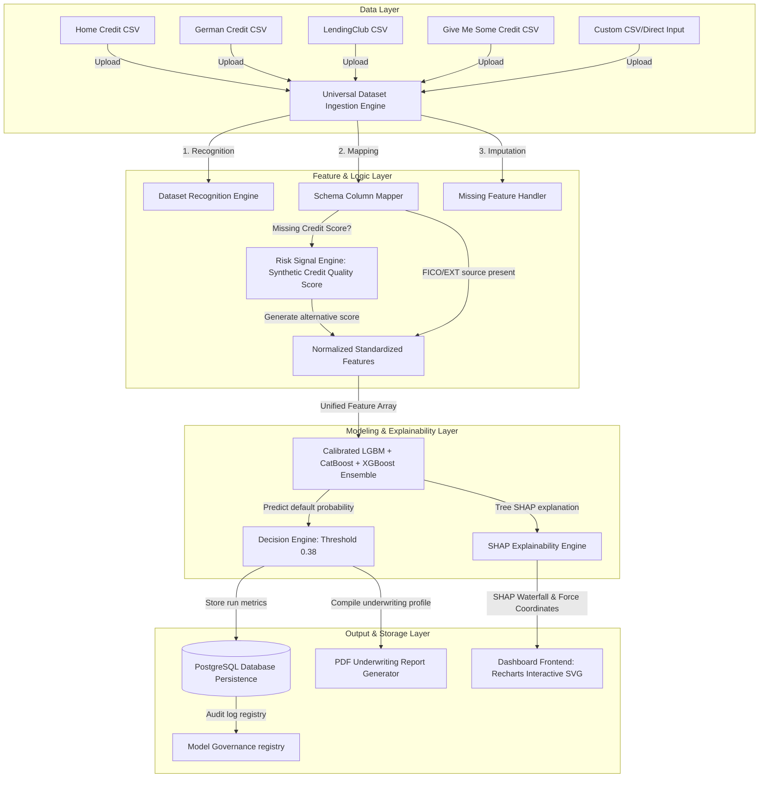

# Universal Credit Risk Intelligence Platform

A machine learning platform for unified credit risk assessment across heterogeneous datasets, combining automated data ingestion, feature normalization, calibrated ensemble modeling, SHAP explainability, underwriting reports, and portfolio-level analysis.



---

## Technical Features

1. **Universal Dataset Ingestion & Recognition**: Automatically detects dataset origin based on header signatures. Applies custom column alignment, monthly-to-annual income conversions, and standardizations.
2. **Risk Signal Engine (SCQS)**: Computes a Synthetic Credit Quality Score (300-850 FICO range) utilizing `loan_grade`, `loan_int_rate`, `credit_history`, and `default_history` if standard credit scores are absent.
3. **Calibrated Ensemble Model**: Integrates LightGBM, XGBoost, and CatBoost in a soft-voting ensemble optimized via Optuna (achieving a validation **ROC-AUC of 0.8603** and **F1 of 0.6380**). Probability predictions are Platt-calibrated.
4. **Interactive SHAP Visualizations**: Computes Tree SHAP values on the backend and streams raw contributions to the frontend, rendering interactive, responsive SVG waterfall charts.
5. **PDF Report Compiler**: Utilizes `reportlab` to output corporate-grade PDF credit risk summaries featuring applicant data, SHAP factors, and recommendations.
6. **Authentication & Role Security**: Secures routes with JWT tokens, segmenting workspace privileges for `Admin`, `Risk Analyst`, and `Manager` roles.
7. **Database Persistence**: Implements persistent SQLAlchemy schemas with SQLite fallback.

---

## Installation & Quick Start

### Backend Setup

1. **Prerequisites**: Python 3.10+ and virtualenv.
2. **Install Dependencies**:
   ```bash
   pip install -r requirements/requirements.txt
   pip install passlib bcrypt reportlab catboost pytest sqlalchemy pyjwt
   ```
3. **Prepare the Universal Dataset**:
   ```bash
   python src/data/prepare_universal_dataset.py
   ```
4. **Train the Calibration Model**:
   ```bash
   python notebooks/train_universal_model.py
   ```
5. **Run FastAPI Server**:
   ```bash
   uvicorn backend.main:app --host 127.0.0.1 --port 8000
   ```

### Frontend Setup

1. **Prerequisites**: Node.js v18+.
2. **Install packages**:
   ```bash
   cd frontend
   npm install
   ```
3. **Run Dev server**:
   ```bash
   npm run dev
   ```

---

## API Specifications

### 1. Authentication
* **`POST /api/auth/register`**: Registers a new user. Required role: `Admin`.
* **`POST /api/auth/login`**: Authenticates user and returns JWT token.

### 2. Predictions & SHAP
* **`POST /api/predict`**: Evaluates risk for a single applicant. Mapped fields or SCQS are calculated dynamically. Returns probability, decision, and SHAP coordinates.
* **`GET /api/explain/shap/{applicant_id}`**: Fetches SHAP waterfall details for a saved applicant.

### 3. PDF Exports
* **`GET /api/applicants/{applicant_id}/report`**: Generates and downloads the `reportlab` PDF report.

### 4. Portfolios
* **`POST /api/portfolio/predict`**: Accepts an uploaded CSV file. Automatically runs recognition, ingestion, predicts target probabilities, compiles aggregate KPIs, and registers records in the database.
* **`GET /api/portfolio/history`**: Lists past portfolio runs.

### 5. Model Governance
* **`GET /api/governance`**: Lists historical models, validation metrics, and threshold calibrations.

---

## Verification & Unit Testing

Execute our test suite to verify code correctness:
```bash
pytest tests/test_platform.py
```
Outputs should display 4 successful passes:
* `test_auth_hashing`
* `test_risk_signal_engine_scqs`
* `test_ingestion_engine_normalization`
* `test_database_init`
